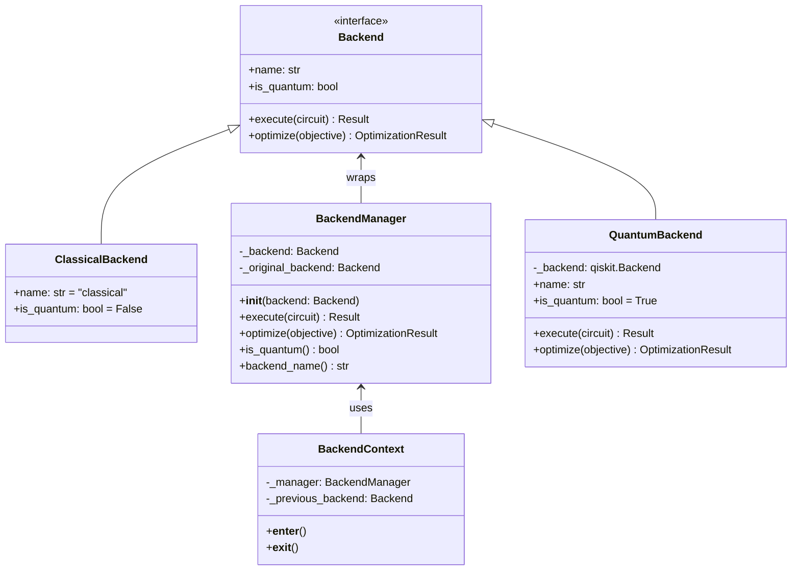
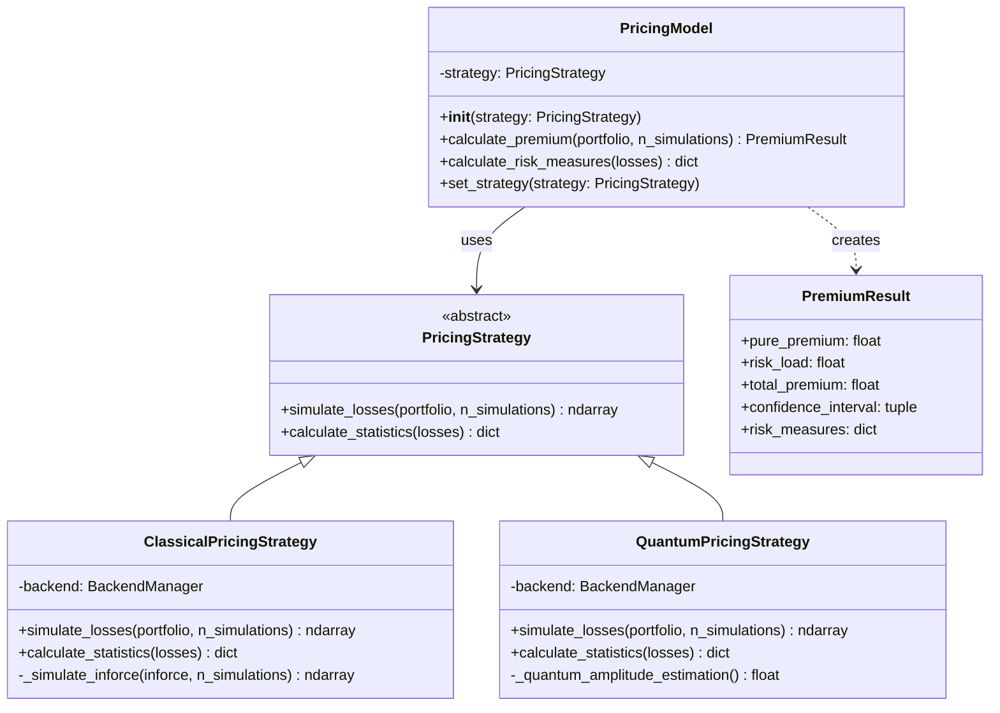
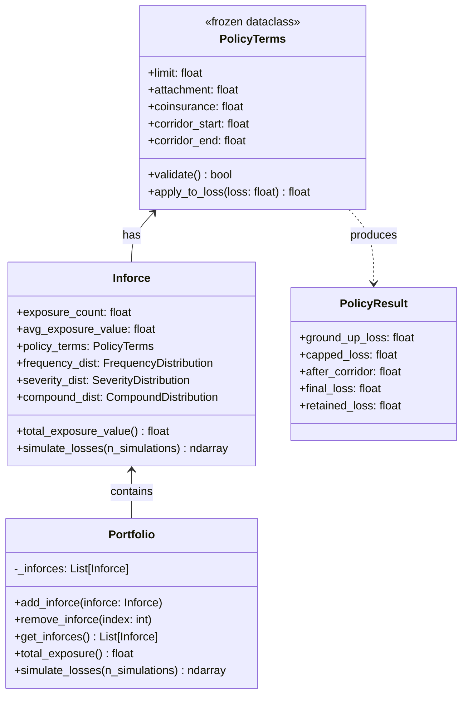
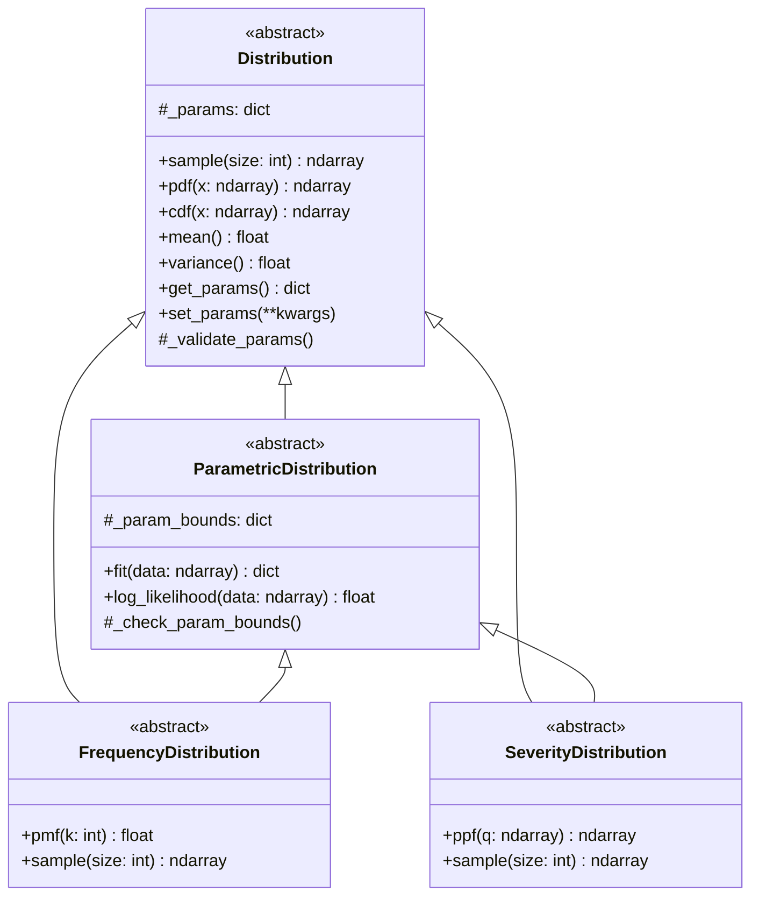
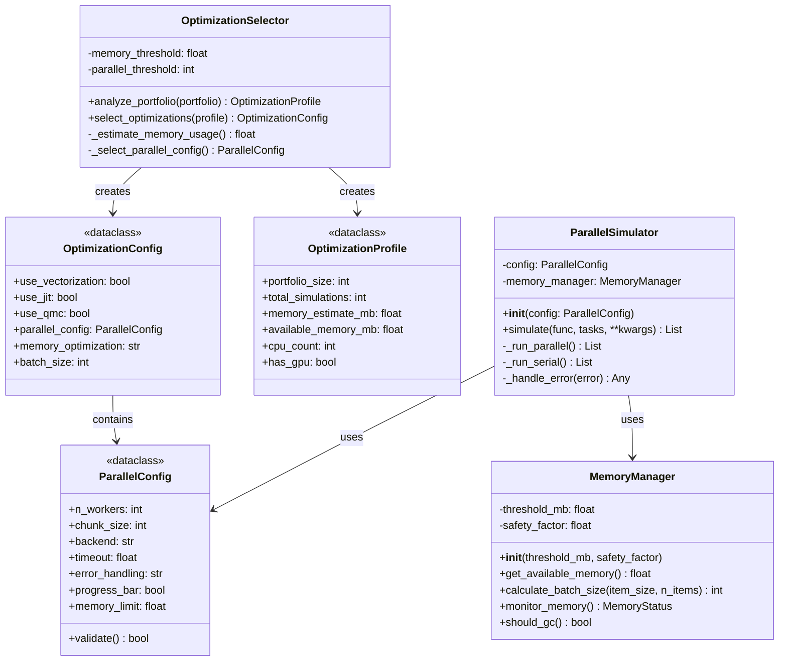
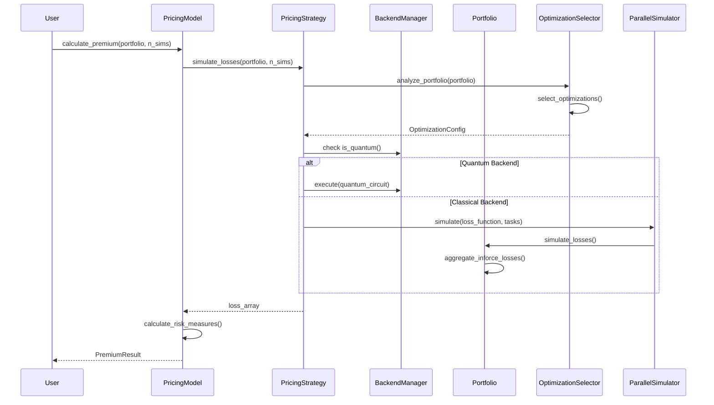

# Core Classes - Detailed Class Diagrams

This document provides detailed class diagrams for the core components of the quActuary system.

## Backend System Classes

## Pricing System Classes

## Business Object Classes

## Distribution Base Classes

## Performance Infrastructure Classes

## Class Interaction Sequence

## Design Patterns Used

### 1. Strategy Pattern (Pricing)
- `PricingModel` uses `PricingStrategy` interface
- Allows runtime switching between Classical/Quantum strategies

### 2. Facade Pattern (Backend)
- `BackendManager` provides unified interface to different backends
- Hides complexity of quantum/classical differences

### 3. Builder Pattern (Portfolio)
- `Portfolio` built incrementally with `add_inforce()`
- Complex objects constructed step-by-step

### 4. Template Method (Distributions)
- Base `Distribution` class defines algorithm structure
- Subclasses implement specific distribution logic

### 5. Singleton Pattern (Backend)
- Global backend instance via `get_backend()`
- Ensures consistent backend across application