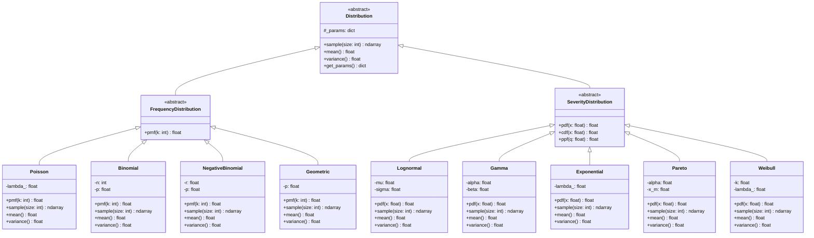
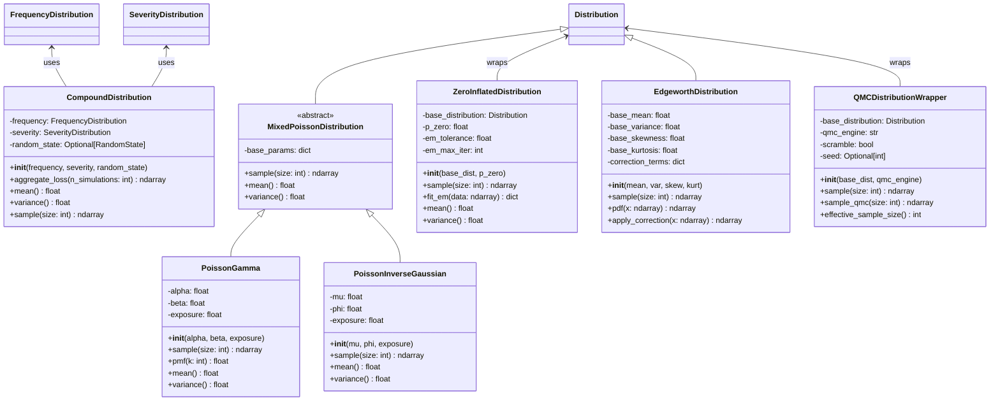
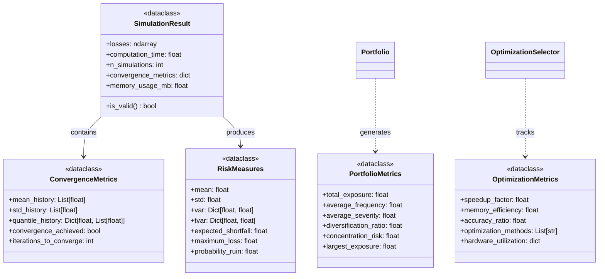
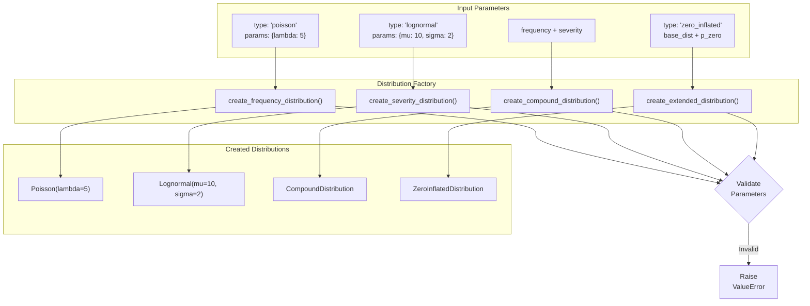
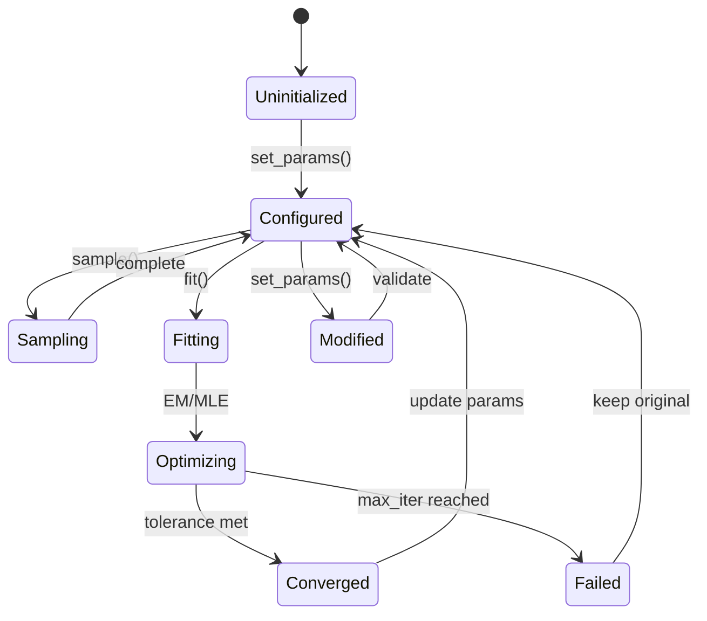
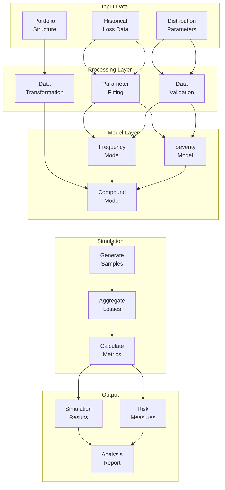
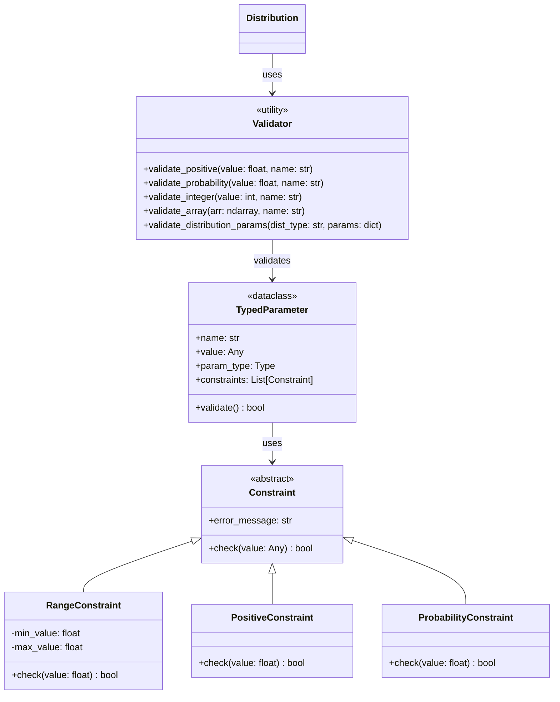

# Data Models and Distribution Classes

This document details the data structures and distribution models used throughout the quActuary system.

## Distribution Hierarchy

## Compound and Extended Distributions

## Data Transfer Objects

## Distribution Factory Pattern

## State Management

## Data Flow Through System

## Type System and Validation

