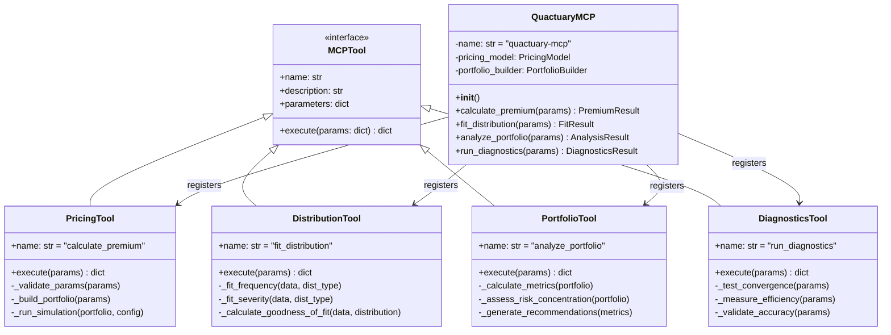
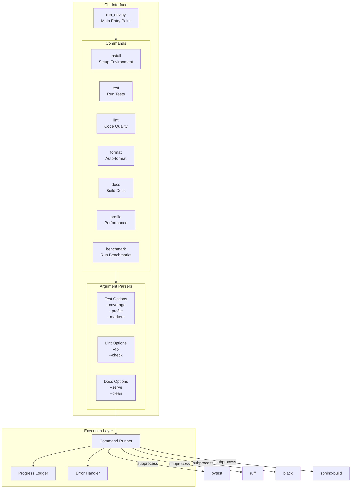
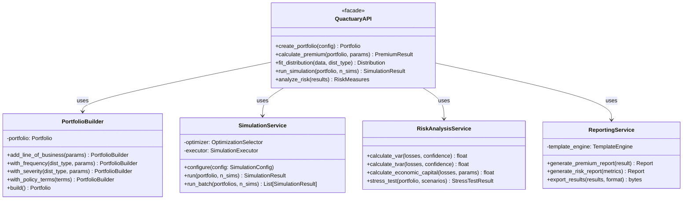
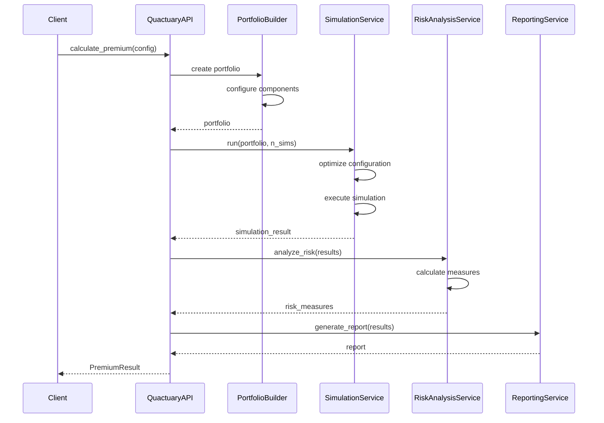
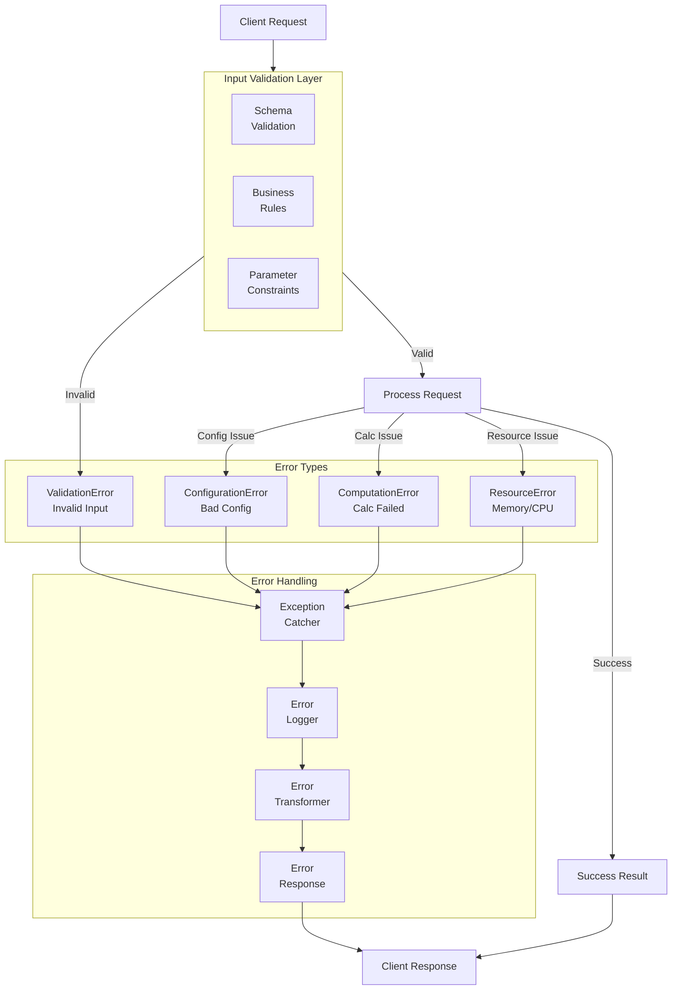
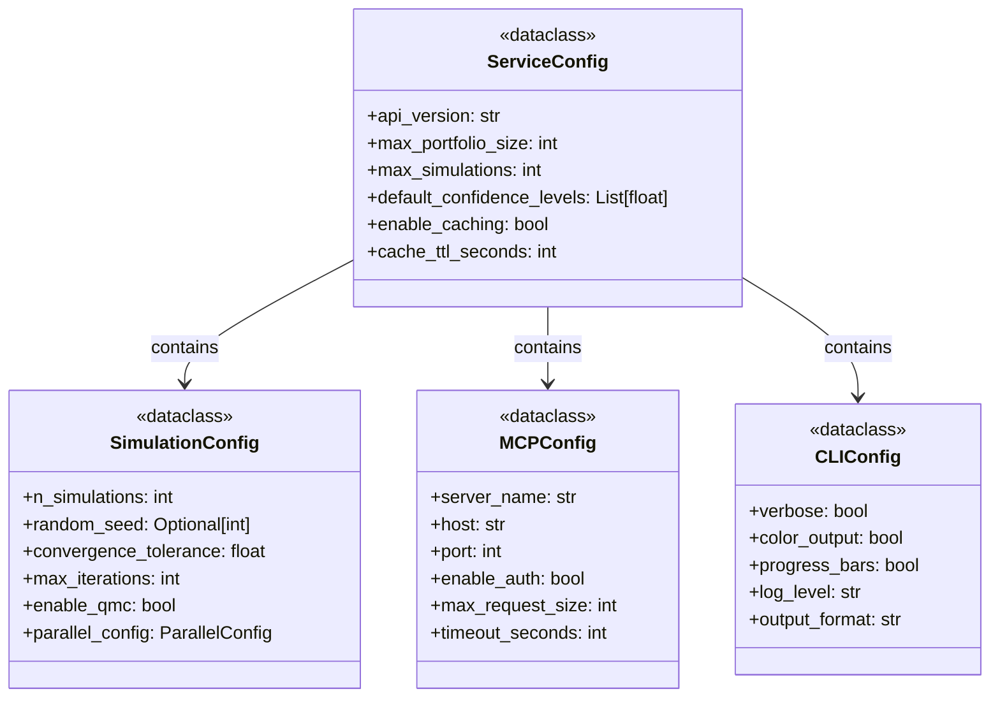
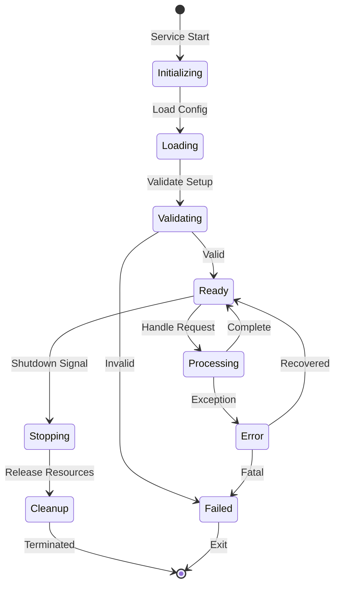
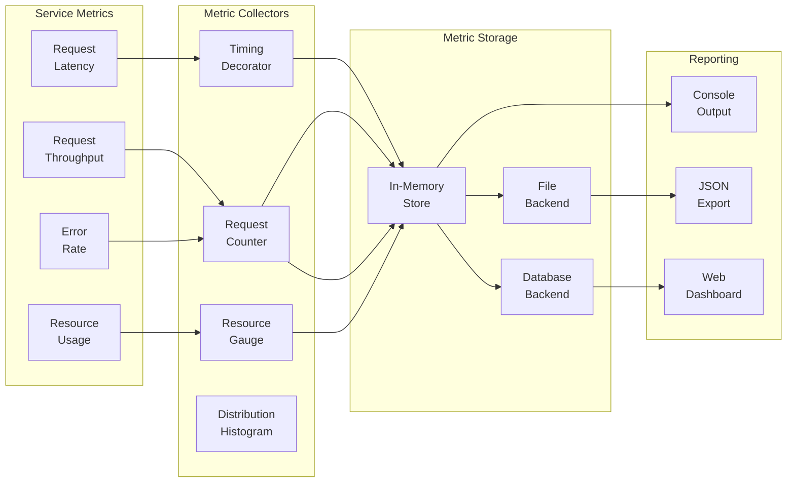

# Service Layer Architecture

This document details the service layer components, including the MCP server, CLI tools, and API interfaces.

## MCP Server Architecture

## CLI Tools Architecture

## API Service Layer

## Service Integration Patterns

## Error Handling and Validation

## Service Configuration

## Service Lifecycle

## Performance Monitoring

