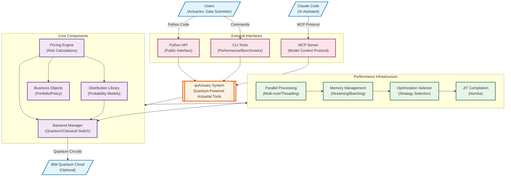
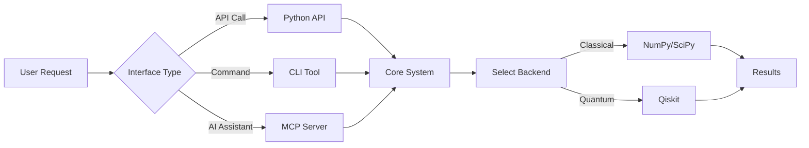
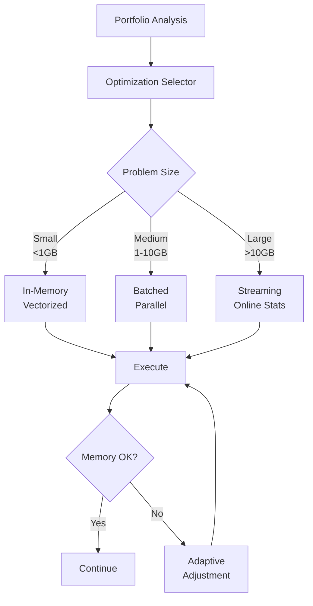

# High-Level System Context Diagram

This diagram shows the overall architecture of the quActuary quantum-powered actuarial modeling framework.

## System Overview

The quActuary system is designed as a modular, high-performance actuarial modeling framework with quantum computing capabilities. The architecture follows these key principles:

### 1. **Layered Architecture**
- **Interface Layer**: Multiple entry points (Python API, CLI, MCP Server)
- **Core Layer**: Business logic and computational models
- **Performance Layer**: Optimization and resource management
- **Backend Layer**: Abstracted quantum/classical computation

### 2. **Key Data Flows**

#### User Interaction Flow

#### Performance Optimization Flow

### 3. **External Integrations**

- **IBM Quantum Cloud**: Optional quantum backend for hardware execution
- **Claude Code**: AI-powered development assistance via MCP
- **Scientific Python Stack**: NumPy, SciPy, Pandas for computation
- **Qiskit**: Quantum computing framework (v1.4.2)

### 4. **Key Architectural Decisions**

1. **Backend Abstraction**: Seamless switching between quantum and classical computation
2. **Strategy Pattern**: Flexible pricing strategies with runtime selection
3. **Resource Adaptation**: Dynamic optimization based on available resources
4. **Streaming Architecture**: Handle problems larger than available memory
5. **MCP Integration**: Modern AI assistant integration for development

This architecture enables quActuary to scale from simple actuarial calculations to complex portfolio simulations while leveraging quantum acceleration when beneficial.