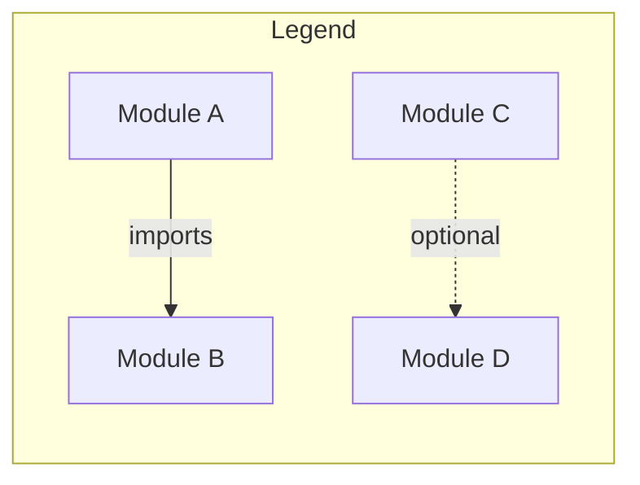
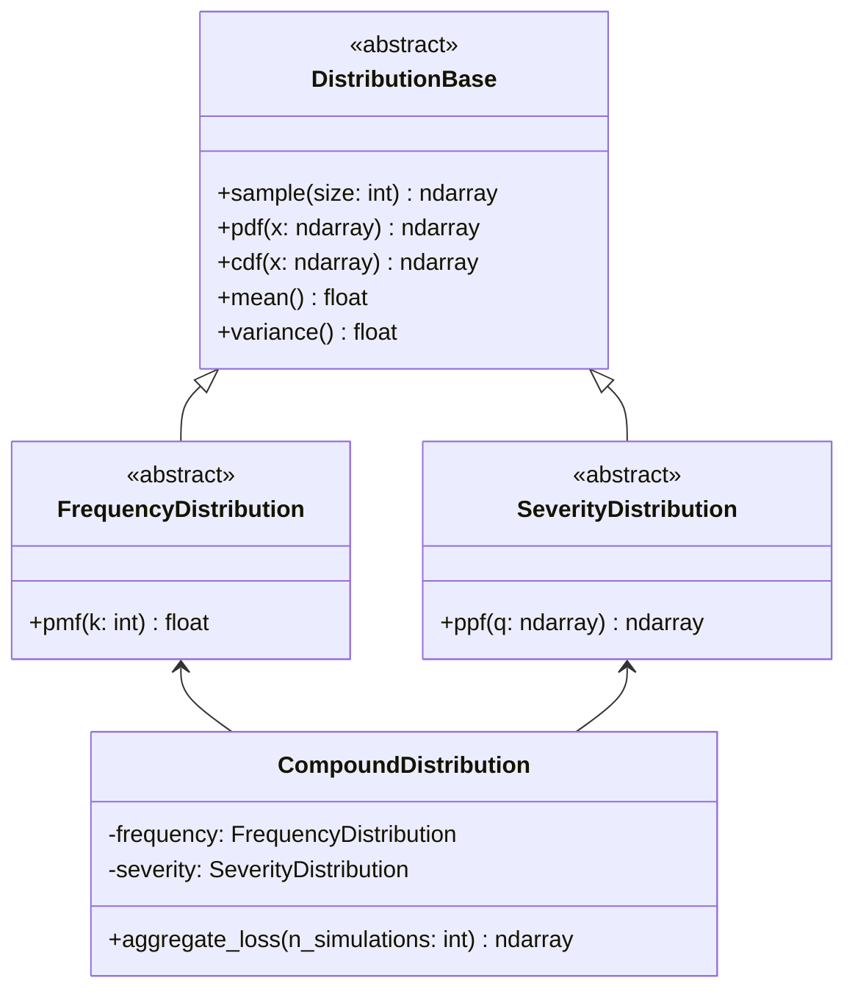
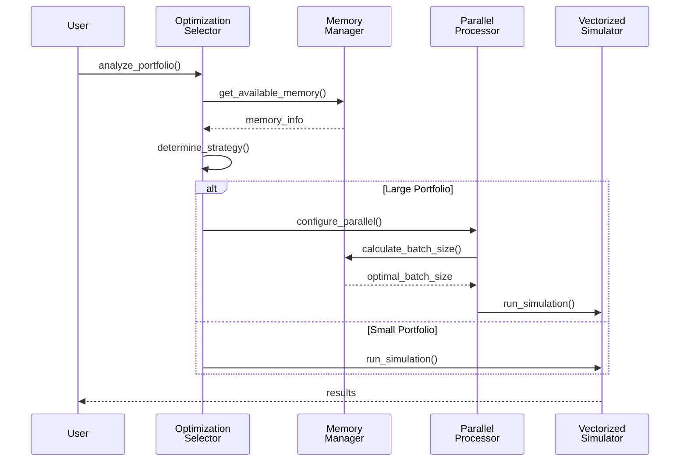
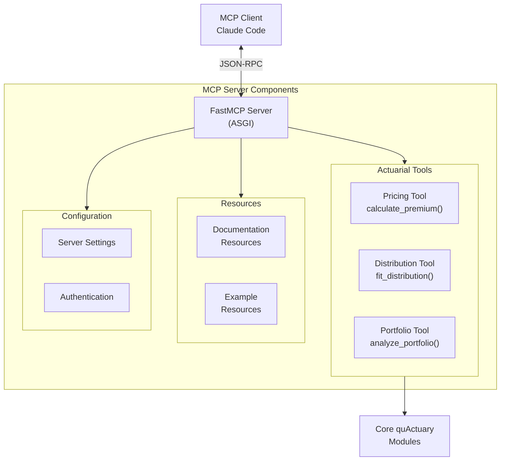

# Module Overview and Relationships

This document provides a detailed view of the quActuary module structure and inter-module dependencies.

```mermaid
graph TB
    %% Core Modules
    subgraph CoreModules["Core Modules"]
        Backend["backend.py<br/>Backend Management"]
        Pricing["pricing.py<br/>Pricing Engine"]
        Book["book.py<br/>Business Objects"]
        Classical["classical.py<br/>Classical Implementation"]
        Quantum["quantum.py<br/>Quantum Algorithms"]
    end
    
    %% Distribution Module
    subgraph DistributionModule["distributions/"]
        DistBase["Base Classes<br/>(FrequencyDistribution,<br/>SeverityDistribution)"]
        Frequency["frequency.py<br/>(Poisson, Binomial,<br/>NegativeBinomial)"]
        Severity["severity.py<br/>(Lognormal, Gamma,<br/>Exponential, Pareto)"]
        Compound["compound.py<br/>Aggregate Loss Models"]
        Extended["Extended Distributions"]
        
        subgraph ExtendedDist["Extended"]
            MixedPoisson["mixed_poisson.py<br/>Poisson-Gamma,<br/>Poisson-IG"]
            ZeroInflated["zero_inflated.py<br/>Zero-Inflated Models"]
            Edgeworth["edgeworth.py<br/>Moment Corrections"]
            QMCWrapper["qmc_wrapper.py<br/>Variance Reduction"]
        end
    end
    
    %% Performance Infrastructure
    subgraph Performance["Performance Infrastructure"]
        ParallelProc["parallel_processing.py<br/>Multi-core Processing"]
        MemoryMgmt["memory_management.py<br/>Memory Optimization"]
        OptSelector["optimization_selector.py<br/>Strategy Selection"]
        VectorSim["vectorized_simulation.py<br/>Batch Operations"]
        JITKernels["jit_kernels.py<br/>Numba Compilation"]
        Sobol["sobol.py<br/>QMC Sequences"]
    end
    
    %% MCP Server
    subgraph MCPServer["mcp/"]
        MCPBase["base.py<br/>Server Foundation"]
        MCPTools["tools.py<br/>Actuarial Tools"]
        MCPConfig["config.py<br/>Configuration"]
        MCPServer["server.py<br/>FastMCP Server"]
    end
    
    %% Utilities
    subgraph Utilities["utils/"]
        Numerical["numerical.py<br/>Numerical Helpers"]
        Validation["validation.py<br/>Input Validation"]
    end
    
    %% Dependencies
    Backend --> Quantum
    Backend --> Classical
    
    Pricing --> Backend
    Pricing --> Book
    Pricing --> DistBase
    
    Classical --> DistBase
    Classical --> ParallelProc
    Classical --> MemoryMgmt
    
    Compound --> Frequency
    Compound --> Severity
    Compound --> DistBase
    
    Extended --> DistBase
    MixedPoisson --> Frequency
    ZeroInflated --> DistBase
    QMCWrapper --> DistBase
    QMCWrapper --> Sobol
    
    ParallelProc --> MemoryMgmt
    OptSelector --> ParallelProc
    OptSelector --> MemoryMgmt
    OptSelector --> VectorSim
    
    VectorSim --> JITKernels
    
    MCPTools --> Pricing
    MCPTools --> DistBase
    MCPServer --> MCPBase
    MCPServer --> MCPTools
    
    %% Styling
    classDef core fill:#e3f2fd,stroke:#1565c0,stroke-width:2px
    classDef dist fill:#f3e5f5,stroke:#6a1b9a,stroke-width:2px
    classDef perf fill:#e8f5e9,stroke:#2e7d32,stroke-width:2px
    classDef mcp fill:#fff3e0,stroke:#ef6c00,stroke-width:2px
    classDef util fill:#f5f5f5,stroke:#616161,stroke-width:2px
    
    class Backend,Pricing,Book,Classical,Quantum core
    class DistBase,Frequency,Severity,Compound,MixedPoisson,ZeroInflated,Edgeworth,QMCWrapper dist
    class ParallelProc,MemoryMgmt,OptSelector,VectorSim,JITKernels,Sobol perf
    class MCPBase,MCPTools,MCPConfig,MCPServer mcp
    class Numerical,Validation util
```

## Module Dependency Matrix



### Core Module Dependencies

| Module | Direct Dependencies | Purpose |
|--------|-------------------|----------|
| `backend.py` | quantum, numpy, qiskit | Backend abstraction for quantum/classical switching |
| `pricing.py` | backend, book, distributions | Main pricing engine with strategy pattern |
| `book.py` | dataclasses, typing | Business object definitions (Portfolio, Policy) |
| `classical.py` | distributions, parallel, memory | Classical Monte Carlo implementation |
| `quantum.py` | qiskit, numpy | Quantum algorithm implementations |

### Distribution Module Structure



### Performance Module Interactions



### MCP Server Architecture



## Import Hierarchy

The following shows the import hierarchy from top-level user-facing modules down to utilities:

1. **User Entry Points**
   - `__init__.py` → Exposes public API
   - `cli/` → Command-line tools
   - `mcp/server.py` → MCP server

2. **Business Logic Layer**
   - `pricing.py` → Main pricing interface
   - `book.py` → Business objects
   - `distributions/` → Probability models

3. **Computation Layer**
   - `backend.py` → Backend selection
   - `classical.py` → Classical algorithms
   - `quantum.py` → Quantum algorithms

4. **Infrastructure Layer**
   - `parallel_processing.py` → Parallelization
   - `memory_management.py` → Memory optimization
   - `optimization_selector.py` → Strategy selection

5. **Foundation Layer**
   - `utils/` → Shared utilities
   - `jit_kernels.py` → Performance kernels
   - `datatypes.py` → Type definitions